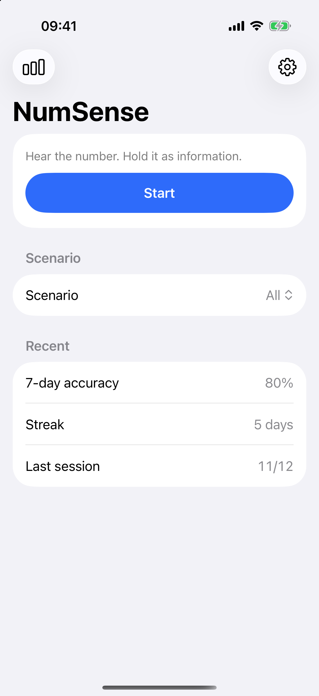
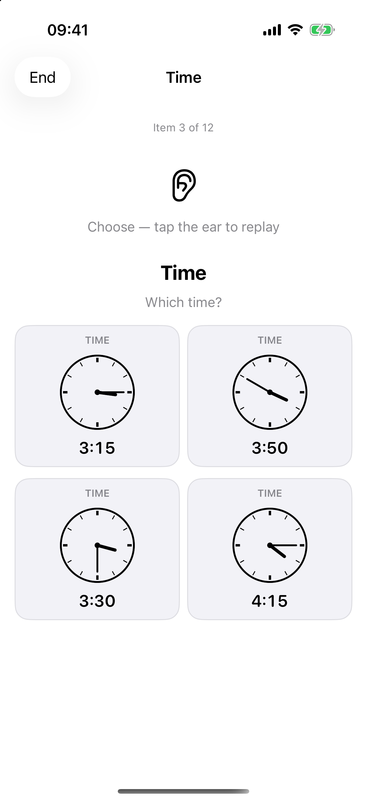
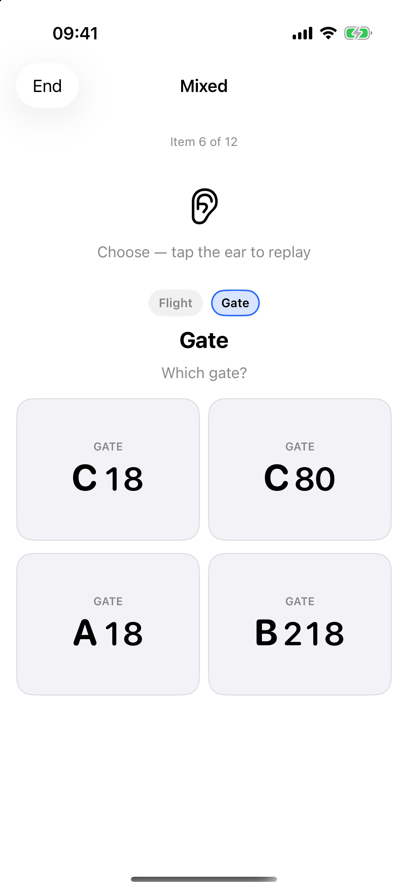
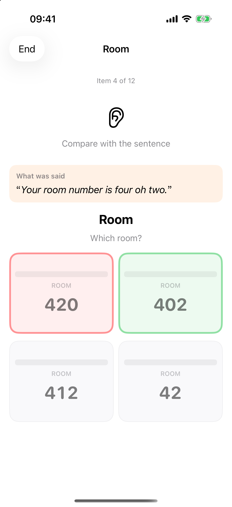
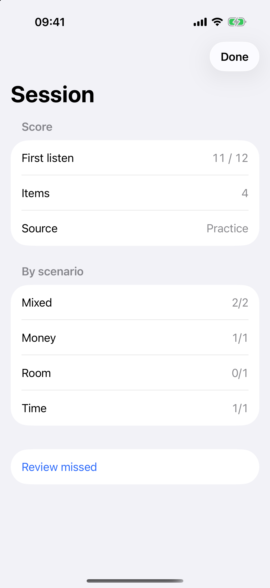
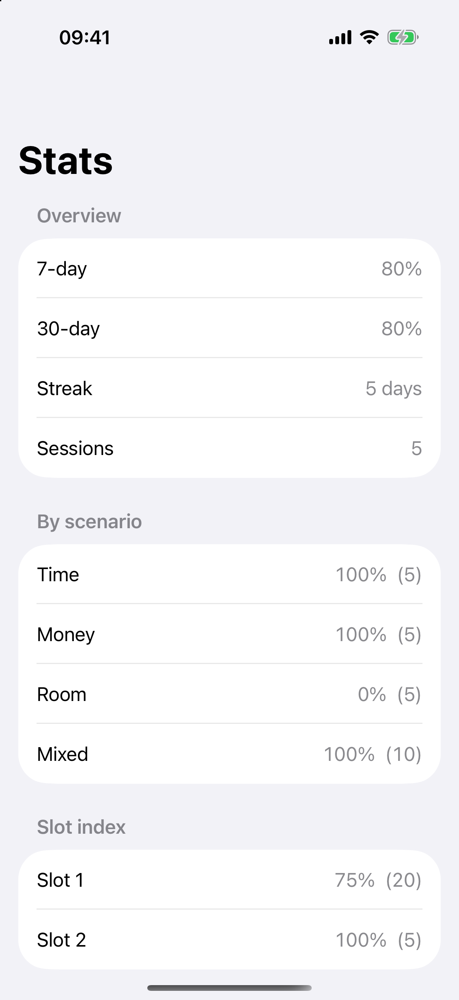

  

# NumSense · 数字语感

听一遍美式口语里的数字，当场当成信息留下来——几点、几号房、多少钱、哪个登机口。

英语数字常常听得懂，却转眼就忘，或要先在脑子里翻成中文才记得住。NumSense 练的是把听到的数字直接留成可用信息，再在钟面、日历、门牌、价签这些画面上认出来。

本 App **不上架 App Store**，用 Xcode 自签名装到 iPhone 即可。主屏幕名称是「数字语感」，界面为英文。

## 界面预览

| 主界面 | 钟面时间识别 | 复合场景分步识别 |
| :---: | :---: | :---: |
|  |  |  |
| 快速开始与近期训练统计 | 听口语时间，直觉反应表盘 | 航班与登机口多信息留存 |

| 即时纠错与原文对照 | 单次训练小结 | 本地长期统计 |
| :---: | :---: | :---: |
|  |  |  |
| 标出正误并提供原句反馈 | 场景得分与一键复习错题 | 7天/30天正确率与易混项分析 |

## 怎么练

每次播一句日常语速的美式英语。停一秒后，出现 2×2 图像选项；一句里有多个数字，就按顺序分步问。点对进入下一题；点错会立刻标出正确图，并再播一遍作为反馈。没听清时，点耳朵图标可以再听。

一次大约 8、12 或 20 题，几分钟就能练完。可按场景筛选：时间、日期、钱、房号、出行、电话、地址、计量，或把几种数字混在一句里。

每一次作答都记在本机，可看正确率、连续天数和错题，也可导出 JSON / CSV。没有账号，数据不会上传。

## 在 iPhone 上自签名安装

需要 [Xcode 27](https://developer.apple.com/xcode/) 和一台运行 **iOS 17 或更高** 的 iPhone。用你的 Apple ID 签名即可，不必加入付费开发者计划。

1. USB 连接 iPhone，首次连接时在手机上信任这台电脑。
2. 打开 `NumSense.xcodeproj`，Scheme 选 **NumSense**，设备选你的 iPhone。
3. Signing 选你的个人团队（Automatic Signing）。
4. Product → Run。
5. 首次安装后：设置 → 通用 → VPN 与设备管理 → 信任该开发者。

免费个人证书大约 7 天到期，到期后重新 Run 即可。付费 Apple Developer 账号可签一年。

## License

[MIT](LICENSE)
